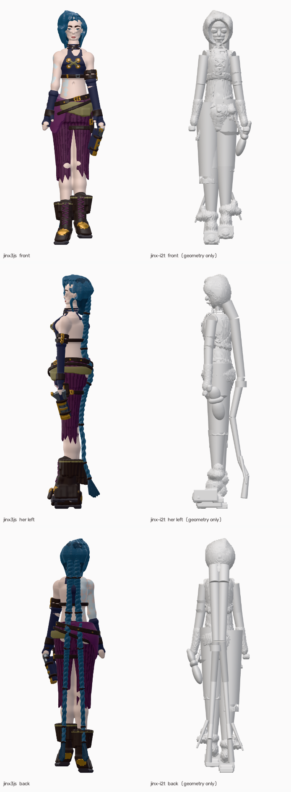

# AI PCG Test — 一张参考图 → 代码生成的 3D 资产的三条路

没有一件是手工建模的。每个资产都是**一段程序**——一个在加载时自己构建几何的 TypeScript 工厂——
并且每一个都由**不属于它自己的**工具，对着原作者的转身图打分。

三条线跑的不是同一件事，这一点在最后才看清楚：一条追相似度，一条追可被检查、度量、编辑和驱动的结构，
第三条把「约束先于资产」这个主张照字面执行了一遍。

## 📖 在线阅读（推荐）

在线版：<https://seanwilliam2077.github.io/AI-PCG-Test/docs/gate.html> ·
<https://seanwilliam2077.github.io/AI-PCG-Test/docs/routes.html>

| 页面 | 内容 |
|---|---|
| [`docs/gate.html`](docs/gate.html) | **闸门记录** — 36 次尝试逐条展开，分数走势图，八道 pass，49 个 agent 的编队 |
| [`docs/routes.html`](docs/routes.html) | **三条线放在一起看** — 逐项拆分、原始指标、差距分析 |
| [`docs/COMPARISON.md`](docs/COMPARISON.md) | 两条角色线的完整对照，含两轮迭代前后 |

这两个 HTML 里**每一个数字都由 [`tools/build_report.py`](tools/build_report.py) 从
[`process/`](process/) 下的 JSON 生成**，没有一处写死在页面里。页面和记录不一致，是脚本的 bug，
不是谁忘了改标题。

## 三条线

| | 线 1 `jinx3js` | 线 2 `jinx-i2t` | 线 3 `zapper-i2t` |
|---|---|---|---|
| 对象 | Arcane 金克斯 | 同一个角色 | 金克斯的手枪 |
| 几何 | 手写 SDF + 朴素 Surface Nets | 一份 spec 驱动的基元装配 | 硬表面，约束先行 |
| 依据 | — | [img2threejs](https://github.com/img2threejs/img2threejs) 八道 pass | [Nova3D](https://arxiv.org/abs/2607.22738) arXiv 2607.22738 |
| 记分板 | **41.21 / 100** | 35.35 → **38.68 / 100** | 合同冻结并经对抗审查，建模进行中 |
| 部件 | 15 个 shell | **85 个命名组件** | 33 个命名部件 |
| 骨骼 | 无 | **19 根**，插槽误差 0.05 mm | 合同已声明关节与轴 |

---

## 线 1 · `jinx3js` — 手写 SDF，Surface Nets 出网格

TypeScript 里手写有符号距离场，朴素 Surface Nets 多边形化，三档 LOD，编码成定型数组内嵌进
`.ts`。没有模型文件，没有贴图——材质是代码里的程序化项。

相似度最高的一条：**41.21 / 100**。代价是这个相似度活在手调常数里，改参考就得重来。

**这一线抓到的事**：`smoothSubtract` 的符号写反，把整个颅骨减没了——用 k→0 极限退化成
`max(A, -B)` 验证才定位到。参考里"两条腿贴在一起"是辫子横跨造成的误读；"靴子在地面并成一坨"
也是误读，实际是有一只脚抬高了 47 mm。

## 线 2 · `jinx-i2t` — 一份 spec 走完八道 pass

`object-sculpt-spec.json` 一份文件，85 个组件、20 个材质、19 根骨，经
`generate_threejs_factory.py` 生成 1.3 MB 的工厂代码。八道 pass 每道有数值验收标准，
没有记录评审就不解锁下一道。

**两轮迭代 35.35 → 38.68**，与线 1 的差距从 5.86 收到 2.53。六项里**领先四项**——
形状、边缘、Chamfer、区域色——原始轮廓 IoU **0.7249 对 0.7114** 已经反超。
剩下的差距几乎全部在地标高度一项。

**这一线抓到的事**（九条，全部通过了严格 schema 校验，全部是渲染+测量才发现的）：

| 写下的 | 实际读它的 | 后果 |
|---|---|---|
| 带 attachment 的部件写 `transform.position` | 生成器读 `attachment.localStart` | 所有组件塌到父节点原点，人渲成一根柱子 |
| `primitive: capsule` | 带 attachment 的部件被扫成锥台，`primitive` 根本不看 | 全部变成圆锥 |
| 为归一化写 `scale: [1,1,1]` | `transform.scale` **整个覆盖** `dimensions` | 101 个实测尺寸作废 |
| 绝对世界高度 | 位置是父级局部且**累加** | 1.72 m 的人，发冠在 y 8.6 |
| 裤子写成一个组件 | 一个组件 = 一个扫掠体 | 一根管子吞掉两条腿和中间的空隙 |
| 正确材质写在 `materialRef` | 生成器读 `material` | 20 个材质里 14 个闲置，整个人只有两种颜色 |
| `appliesTo: "pants-l, pants-r"` | 发射器读 `parent` / `placement` / `instanceScale` | 26 根细条纹和 9 个扣件全堆在世界原点 |
| 103 个部件全写 `pivot.mode: "center"` | 没有东西反对 | 前臂绕自己中点转，那个点不在身上 |
| `uvStrategy` | **没有任何东西读它** | 这个字段是装饰，接缝是结构性的 |

## 线 3 · `zapper-i2t` — 硬表面，约束先于模型

Nova3D 的主张：生成的 3D 物体不该是一张不透明曲面，而该有命名部件、装配层级、
**事先声明的可度量约束**、局部编辑句柄、原生关节。它报告 51/52 条约束满足（最强基线 11/52）、
18/18 保持编辑局部性、59 个关节 98.3% 几何有效。

这一线把它照字面执行：**先冻结合同，再建模**。目前合同已冻结并经过独立重测，验收工具已就位并冒烟通过；
模型本身还在建。这个顺序是有意的——先声明再建造，才谈得上「事先声明的约束」。

[`zapper-i2t/docs/CONTRACT.md`](zapper-i2t/docs/CONTRACT.md) 907 行、**123 条约束**
（比值 54、关系 30、计数 18、角度 11、尺寸 10）、33 个命名部件的单根无环装配树、
20 处测量分歧逐条记录裁决。

两个设计决定值得说：

- **只有 10 条依赖尺度链，其余 113 条写成比值** —— 参考里没有任何一处尺寸标注，
  整个绝对尺度建立在另一个模型里一个声明值上。写成比值，那个公理错了也不影响。
- **有一节叫「参考无法裁定的部分」** —— 握把侧面在九个视图里零可见像素，就标 `[?]`，
  不编一个形状出来。

验收工具在模型存在**之前**就写好了：[`tools/check_contract.py`](zapper-i2t/tools/check_contract.py)
逐条打分并检查装配树与关节几何有效性，**查不了的约束算失败而不是跳过**；
[`tools/locality_test.py`](zapper-i2t/tools/locality_test.py) 扰动一个句柄重建，
该动的没动和不该动的动了同样算失败。

### 合同冻结之后，交给一个只被要求「推翻它」的 agent

它从图纸像素独立重测了 18 条约束，**13 条复现**，好几条到 1 像素以内——包括最可能崩的那些：
菱形孔的 N–R 拟合、材质接缝、内衬台阶、气阀与枪口环的间隙、握把跟部落差、身高跨度，
以及那个 1.67 倍的尺度修正。

然后它找出 25 条缺陷。三条特别值得说：

**它证伪了合同的一条材质结论。** 合同写「握把侧面在九个视图里零可见像素」，
并据此判定简报里的「深红棕木质」没有任何像素支持。攻击者在 pose3 找到一块干净的握把侧面，
**388 个像素**测出 a\* +6.48 / b\* +11.44 的暖色。枪托底盖确实和机匣涂装一致（差 0.5 a\*、
0.35 b\*）——原始证据**对于底盖是对的，被推广到了整个握把**。冷蓝灰上的阴影只会更蓝，
不会走到 b\* +11.4。

**它抓到了这份文档里唯一一处伪造，而且不在测量里。** 关节限位写着「已几何验证……
20 个中间姿态互不穿插」。互穿检测是网格计算，而同一份文档第 5 行写着
**「Nothing has been modelled」**。用它自己的话说：

> 每一个抽查的数字都能追溯到真实像素。这份文档里的伪造不在测量里，
> 而在 D-19——一次关节限位验证被报告为「已执行」，而同一份文档说那个几何体不存在。

**它算出这份合同在动手之前就虚高约 15%。** 123 条里有 9 条**任何构建模型都无法让它失败**
（比例尺本身、需要角色手部网格的比值、文档间的算术比较）、6 条按写法根本跑不起来、
4 条「检查的东西和它声明的值不是一回事」。

> 按 51/52 那种算法在这份文档上打的分会虚高约 **15%**。正确的呈现是
> **104 条可证伪 / 94 条真正收紧**。

`docs/contract.json` 因此把那 19 行标成 `falsifiable: false`，`check_contract.py` 按
**104** 计分而不是 123。一条不可能失败的约束不是「管线满足约束」的证据，是注水——
把它算进满足率里，正是让这类比值不值得信的那个失效模式。

审查结果**没有覆写合同**，而是作为第 11 节附在原文旁边：冻结时是什么，攻击查出了什么，两者都留。
这也是这个仓库里其他地方的做法——`baseline/ledger.json` 保留了全部 20 次否决。

## 三条线放在一起看

→ 完整逐项拆分见 [`docs/routes.html`](docs/routes.html)

| 分项 | 权重 | 线 1 | 线 2 初始 | 线 2 现在 | 剩余差距 |
|---|---|---|---|---|---|
| 形状（轮廓 IoU） | .30 | 0.7051 | 0.7061 | **0.7208** | −0.47 ← 线 2 领先 |
| 边缘 F | .15 | 0.3833 | 0.3421 | **0.4157** | −0.49 ← 线 2 领先 |
| 轮廓 Chamfer | .10 | 0.4021 | 0.3787 | **0.4248** | −0.23 ← 线 2 领先 |
| 宽度剖面 | .20 | 0.2393 | 0.1390 | 0.1814 | +1.16 |
| 地标高度 | .15 | 0.2393 | 0.0655 | 0.0587 | +2.71 |
| 区域色 | .10 | 0.1913 | 0.1488 | **0.2065** | −0.15 ← 线 2 领先 |
| **合计** | | **41.21** | 35.35 | **38.68** | **+2.53** |

左列 `jinx3js` 带材质——它的材质是 TypeScript 里的程序化项，不含任何参考像素。
右列 `jinx-i2t` 只有几何——它带材质的渲染烘了从参考提取的反照率，所以只发剥掉材质的版本。
规则是逐张判定的，见 [`images/PROVENANCE.md`](images/PROVENANCE.md)。

### 差距分析

线 1 在相似度上仍然赢，剥掉贴图的对比更不接近。但**剩下 2.53 分几乎全部是地标高度一项**——
东西长在哪，不是外形是什么。

那一项失败过三次，三次都值得记下来：

1. 补丁把 delta 写死，等另一个补丁把 `hair-crest` 合并掉之后直接 `KeyError` 崩了。
2. 改成运行时重测，但用的是自己写的地标检测器——它在同一轮里要求膝盖下移 60 mm、
   小腿肚上移 60 mm。小腿肚在膝盖下面。那不是模型缺陷，是两个坏读数，照做之后每一项都变差，
   包括它本来要修的那一项。
3. 最后改用**裁判自己的地标表**：它按语义命名、报告每个地标在六个视角里被测到几次、
   并把落在搜索边界上的读数标出来以便剔除。按视角数加权阻尼之后，
   最可靠的 `hip` 从 +4.25% 压到 +1.68%。

诚实的读法：这两条线本来就不在比同一件事。

## 仓库导览

| 路径 | 内容 |
|---|---|
| [`METHOD.md`](METHOD.md) | **方法论** — 十条，每条挂一个真实的失败案例。最值得读的一份 |
| [`REFERENCES.md`](REFERENCES.md) | img2threejs 的阶段结构、Nova3D 摘要与基准数字、主张到字段的映射表 |
| [`process/`](process/) | 机器可读的过程记录：闸门账本、pass 阶梯、agent 编队 |
| [`docs/`](docs/) | 交互报告，从 `process/` 生成 |
| [`images/`](images/) | 纯几何渲染 + 逐张可发布性说明 |
| [`jinx3js/`](jinx3js/) | 线 1。`src/parts/` 是手写 SDF，`src/generated/` 是烘好的三档 LOD |
| [`jinx-i2t/`](jinx-i2t/) | 线 2。`object-sculpt-spec.json` 是唯一真相源，`analysis/patch_*.py` 是每一次改动及其推理 |
| [`zapper-i2t/`](zapper-i2t/) | 线 3。`docs/CONTRACT.md` 是冻结的合同，`tools/` 是验收工具 |

## 值得一看的几个工程点

**闸门被数字骗了两次，两次都靠眼睛纠正。** 贴图密铺记分板 +0.10，闸门通过——看图发现整个人变成
席纹编织，回退。纯净裁片记分板 −0.10，闸门否决——但拼贴感消失了，用 `--keep` 覆盖并把理由记在账上。
色彩项权重只有 0.10，看不见摩尔纹。现在每个补丁都要出参考/改前/改后的并排图，图是判据的一部分。

**闸门自己也被查出漏洞。** 一个对抗验证 agent 发现 `metrics_accepted.json`、`out/accepted`、
`out/final_clay` 是三个不同的构建——六个补丁作者同时在不一致的基准上测量。修好之后闸门在基线
不完整时**拒绝运行**，而不是悄悄丢掉最重要的判据。修完重跑辫子补丁，从「否决」变成「+0.70 接受」。

**对抗验证推翻了写在简报里的两条前提。** 一个验证者复现了一个已有描述符精确的
2.4 × 1.6 × 2.1 mm 输出，证明我告诉七个作者的「SDF bounds 是米制」是错的——它是归一化的，
生成器之后会再乘一次 `dimensions`。同一轮还确认了 SDF 叠 Catmull-Clark 细分是**硬错误**而非警告，
所以体素的块感是这条路的固有代价，不是靠后续平滑能抹掉的。

**一个只被自己消费的数字永远不会被检验。** 给枪定标要拿角色的手当尺子，六个 agent 里有三个
独立报告了同一个矛盾：那只手只有它自己声明身高对应尺寸的 63%。这个错误从角色项目内部完全看不见。
顺带把简报里的尺度链推翻了 1.67 倍。记在
[`jinx-i2t/docs/CROSS_PROJECT_FINDINGS.md`](jinx-i2t/docs/CROSS_PROJECT_FINDINGS.md)。

**一个不可能失败的约束不是证据，是注水。** 枪的合同冻结了 123 条约束，
对抗审查算下来只有 104 条是任何构建模型真能让它失败的：9 条测的是参考图或角色而不是这把枪，
6 条按写法跑不起来，4 条检查的东西和它声明的值不是一回事。按「51/52」那种算法打分，
这份文档在动手之前就虚高约 15%。这类满足率之所以不值得信，正是因为分母好凑。

**填字段之前先弄清楚谁读它。** 九个 bug 全是同一个错误。`uvStrategy` 根本没有东西读，
所以它要解决的接缝是结构性的。详见 [`jinx-i2t/docs/GENERATOR_CONTRACT.md`](jinx-i2t/docs/GENERATOR_CONTRACT.md)。

## 技术栈

TypeScript · [three.js](https://threejs.org/) · Vite · Playwright（headless Chromium +
SwiftShader，用于确定性的定量取景截图）· Python + OpenCV + NumPy（这里的每一次测量）·
[img2threejs](https://github.com/img2threejs/img2threejs)

## 方法从哪来

这套做法出自 [img2threejs](https://github.com/img2threejs/img2threejs) 项目画廊里的一条：
**"Dual-Sword Warrior — TypeScript procedural surfaces"，作者 Hoài Nhớ**，
标签 `img2threejs v1.5.1 · procedural TypeScript Surface Nets`。那一条把技术命名成了
「程序化 TypeScript Surface Nets」，也就是这里线 1 走的路。

重建作品属于 Hoài Nhớ；此处不主张任何权利，仅作出处引用。

## 说明

参考转身图 © Riot Games，建模与贴图 **Thibaut Granet**
（<https://thibaut_granet.artstation.com/projects/X1aWVw>）。它在这里**只作为测量目标**，
不被转发，从它逐像素派生的东西也不入库——提取的 PBR 贴图、它们的服务副本、去光照后的反照率，
以及任何显示这些贴图的渲染。发布的图一律是纯几何。

离开它的是**测量值**：比例、地标高度、CIE Lab 色中位数——这些以数字形式记录在文档里，
这正是一个测量目标的用途。复现需要自备参考图，放到各项目 README 指明的路径。
